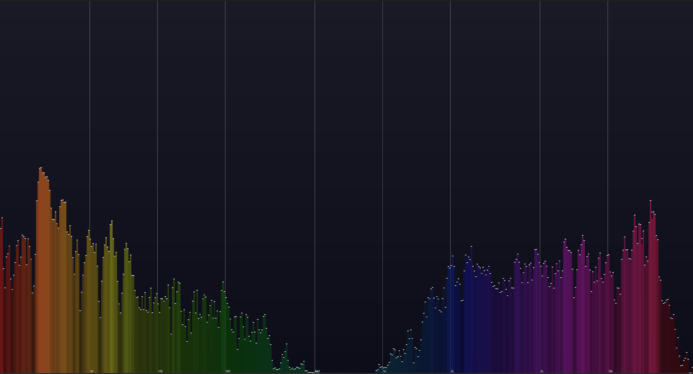

# Spectrum Analyzer

A real-time audio spectrum analyzer built in Rust using Iced for the GUI and CPAL for audio capture. This application provides a beautiful, responsive visualization of audio frequencies with smooth animations and peak indicators.



## Features

- Real-time FFT-based audio analysis
- Smooth frequency visualization with color gradients
- Peak level indicators with decay
- Frequency markers (50Hz - 10kHz)
- Logarithmic frequency scale
- Beautiful background gradient
- Cross-platform compatibility

## Technical Details

- **FFT Size**: 960 samples
- **Sample Rate**: 48kHz
- **Frequency Range**: 20Hz - 24kHz
- **Dynamic Range**: -60dB to 0dB
- **Refresh Rate**: 60Hz (16ms intervals)

## Dependencies

- `iced`: GUI framework
- `cpal`: Cross-platform audio I/O
- `rustfft`: Fast Fourier Transform implementation
- Other standard Rust libraries

## Installation

1. Make sure you have Rust installed on your system:
   ```bash
   curl --proto '=https' --tlsv1.2 -sSf https://sh.rustup.rs | sh
   ```

2. Clone the repository:
   ```bash
   git clone https://github.com/ani3321r/rust-projects
   cd audio_spectrum_analyze
   ```

3. Build and run:
   ```bash
   cargo run --release
   ```

## How It Works

The application works by:

1. **Audio Capture**: Continuously captures audio input using CPAL
2. **Signal Processing**:
   - Applies a Hann window to the input signal
   - Performs FFT to convert time-domain to frequency-domain
   - Converts magnitude to decibels
   - Applies smoothing for visual stability
3. **Visualization**:
   - Maps frequencies logarithmically across the x-axis
   - Represents amplitude through bar height
   - Shows peak levels with white indicators
   - Uses HSV color mapping based on frequency
   - Updates at 60fps for smooth animation

## Configuration

Key constants can be adjusted in the source code:
```
const FFT_SIZE: usize = 960;
const SAMPLE_RATE: f32 = 48000.0;
const MIN_DB: f32 = -60.0;
```
## Contributing

Contributions are welcome! Please feel free to submit a Pull Request.

## Acknowledgments

- The Rust community
- The Iced framework developers
- CPAL developers
- RustFFT developers

## Future Improvements

- [ ] Add ability to select input device
- [ ] Add different visualization modes
- [ ] Add frequency band isolation
- [ ] Add recording capabilities
- [ ] Add configuration UI
- [ ] Add different color themes

## Support

If you encounter any issues or have questions, please file an issue on the GitHub repository.

---

Built with ❤️ using Rust