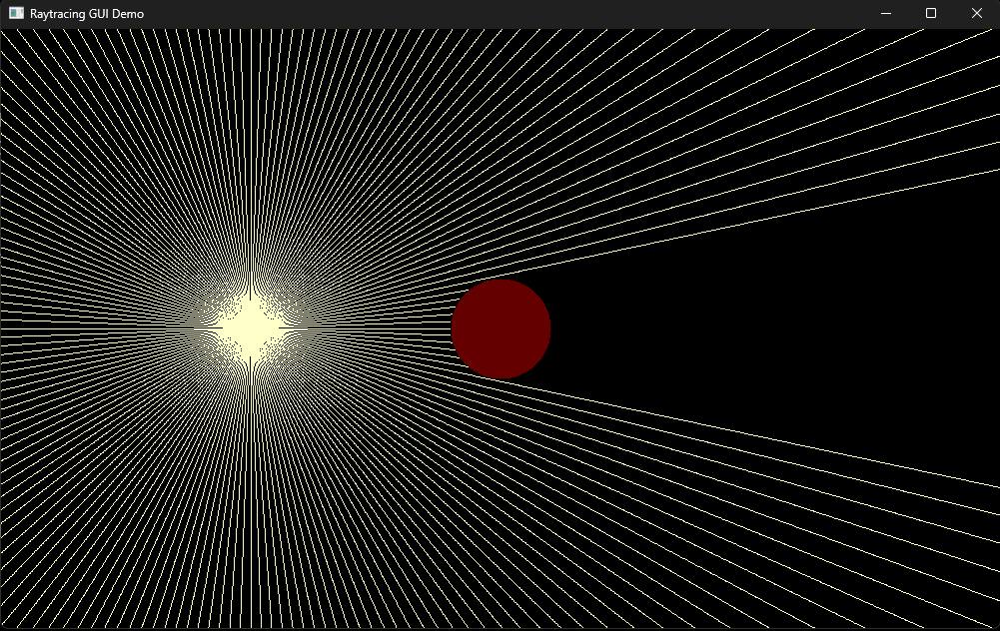

# Raytracing GUI Demo

This project demonstrates a basic raytracing GUI in Rust using the `pixels` and `winit` crates. The application simulates a light source (a small ball) that emits rays in all directions, blocked by a larger ball to cast realistic shadows. The light source can be moved interactively with the mouse.

## Features

- **Interactive Light Source:**
  - Drag the smaller ball (light source) within the window using the mouse.
  
- **Realistic Shadows:**
  - Rays emitted by the light source are blocked by the larger ball, casting shadows accurately.
  
- **Smooth Rendering:**
  - The application updates at a high frame rate for smooth animations.

## Requirements

- Rust (latest stable version)
- Cargo (Rust package manager)

## Usage

1. Clone the repository:
   ```bash
   git clone https://github.com/ani3321r/rust-projects.git
   cd raytracing_demo
   ```

2. Build and run the project:
   ```bash
   cargo run
   ```

3. Interact with the light source:
   - Click and drag the smaller ball to move it around the window.
   - Observe how the rays and shadows update in real time.

## Controls

- **Drag Light Source:** Left mouse button.
- **Exit:** Close the application window.

## Code Overview

### Main Components

1. **`main` Function:**
   - Sets up the window and event loop.
   - Manages the rendering pipeline using `pixels`.

2. **`draw_scene` Function:**
   - Draws the rays, light source, and shadowed areas.
   - Uses geometric calculations to simulate light-ray interactions.

### Constants

- `WIDTH` and `HEIGHT` define the window dimensions.
- `LIGHT_RADIUS` specifies the radius of the light source.
- `BALL_RADIUS` specifies the radius of the larger ball that casts shadows.
- `RAY_STEP` determines the precision of the raycasting algorithm.

## Screenshots



## Future Enhancements

Enjoy experimenting with this raytracing demo! Feel free to contribute or suggest improvements.